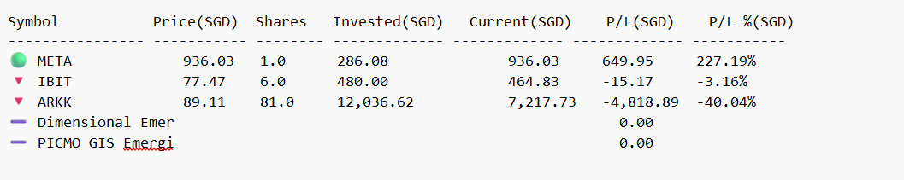

# 📊 Daily Portfolio Tracker & Telegram Reporter

Script to automatically analyzes your investment portfolio, computes real-time profit/loss using live data, and sends a well-formatted daily summary to a Telegram chat.

---

## ✅ Features

- 📈 Fetches live market prices from Yahoo Finance via `yfinance`
- 🌍 Converts foreign prices to SGD using live FX rates (USD/SGD, HKD/SGD)
- 💸 Calculates invested amount, current value, and profit/loss (absolute & %)
- 📊 Summarizes performance by asset type
- 📬 Sends a neat Telegram message (text tables) to your specified group or bot

---

## 🧾 How to Use

### 1. 📋 Prepare Your CSV File

- Create a file called `Financials - Portfolio.csv` with at least the following columns:

| Symbol | Type.1 | Shares | Avg Price (SGD) | Profit/Loss |
| ------ | ------ | ------ | --------------- | ----------- |

- `Symbol`: e.g. `AAPL`, `SPLG`, `CSPX.L`, `D05.SI`, etc.
- `Type.1`: e.g. `Core Equities`, `REITs (SG Focused)`, `Bonds / Cash / CPF`
- `Shares`: Number of shares held
- `Avg Price (SGD)`: Purchase price per share in SGD
- `Profit/Loss`: Optional — manual P/L entries (for fixed income, etc.)

---

### 2. 🔐 Set Environment Variables

- Create a `.env` file in the same folder:
- BOT_TOKEN=your_telegram_bot_token
- CHAT_ID=your_telegram_chat_id

### 3. 📦 Run the script

python portfolio_report.py

### 4. Example Output

### 5. Automation

- Schedule a script to run daily using Windows Task Scheduler or cron (Linux/Mac)
